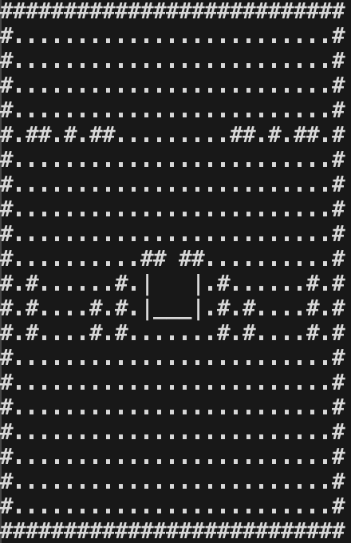
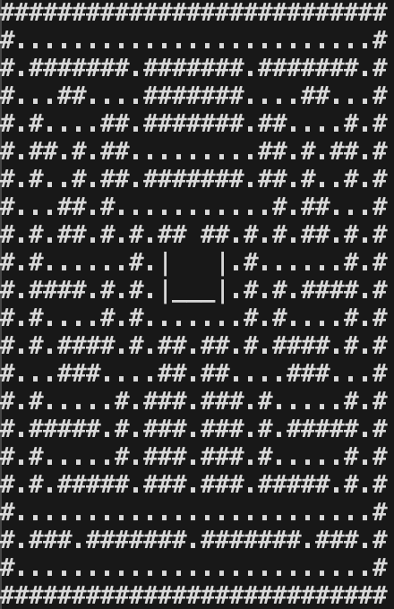

# Comparitive Analysis of Search Algorithms for Pathfinding
Hubba Bubba School for Gifted Elephants & Tiny Humans 2026 Science Fair

## Project Question
How does the choice of pathfinding algorithm affect the efficiency and reliability of finding a target?

### Hypothesis
As pathfinding algorithms become more sophisticated, they will locate the target more efficiently and more reliably. A* is expected to achieve the highest success rate while requiring fewer iterations and less execution time than BFS. Algorithms that rely only on local information, such as Manhattan distance based movement, are expected to perform poorly in maps containing obstacles.

### Data (closed map*)
| Algorithm | Success Rate % | Average Runtime (ms) | Average Iterations |
|-----------|----------------|----------------------|--------------------|
| Random    | .4             | 86.54                | 498000             |
| Manhattan | 0              | 8.96                 | 500000             |
| BFS       | 100            | .029                 | 77                 |
| A*        | 100            | .068                 | 16                 |

### Data (open map*)
| Algorithm | Success Rate % | Average Runtime (ms) | Average Iterations |
|-----------|----------------|----------------------|--------------------|
| Random    | 9.8            | 16.07                | 465164             |
| Manhattan | .8             | 7.72                 | 443001             |
| BFS       | 100            | .046                 | 205                |
| A*        | 100            | .053                 | 24                 |

* max of 500,000 moves allowed before failed attempt
* closed map has full set of routes created by walls
* open map has significantly less walls

### Analysis

### Graphs

### Conclusion
The results supported the hypothesis. Algorithms that used more advanced search techniques generally performed better than simpler approaches. Random movement was inefficient and unreliable. Manhattan-distance-based movement was fast but often failed when obstacles blocked the direct route to the target. BFS consistently found a valid path but required a larger number of iterations. A* achieved a high success rate while exploring fewer nodes and requiring less computation than BFS. These results demonstrate how algorithm design can significantly affect the efficiency and reliability of pathfinding in video games and other navigation problems.

## Takeaway
There is a tradeoff between simplicity, reliability, and computational cost. More informed algorithms can make better decisions and reduce unnecessary search effort.
